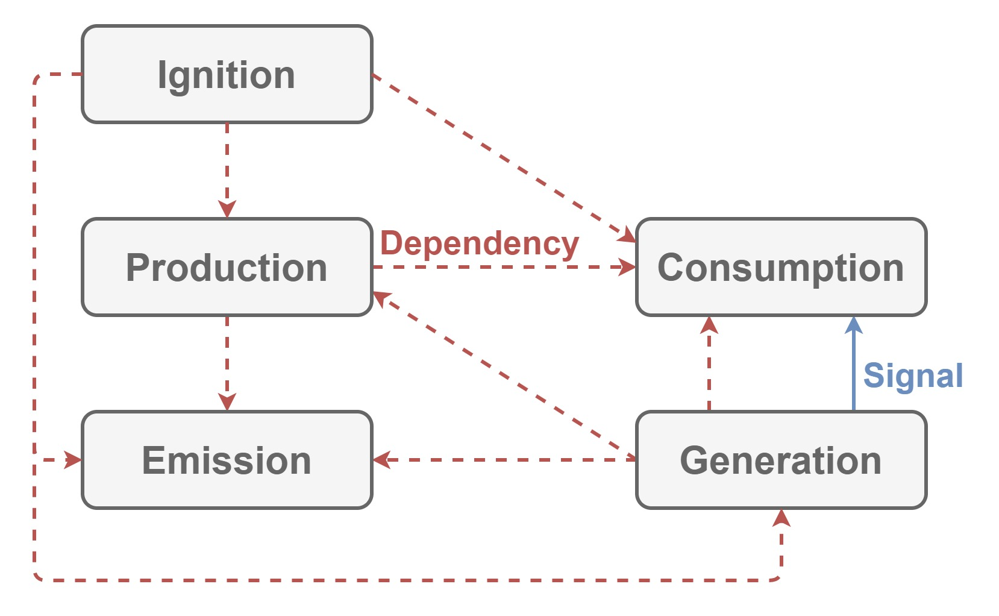

# Conduction

Conduction expands [Signalization](./Signalization.md) to define how to create and distribute `Signal`.

## Dependencies

This module depends on [Signalization](./Signalization.md).

## Architecture

| Word | Abstraction |
|:-----------|:------------|
| Connection | Collector of `Consumption`. |
| Disconnection | Token to disconnection. |
| Propagation | Distributer of `Signal`. |
| Generation | Creator of `Signal`. |
| Ignition | Token to provide `Emission`. |

`Connection` collects `Consumption` to distribute `Signal` sent when `Emission` is executed.  
When `Connection` connects to `Consumption`, `Connection` provides `Disconnection` token to disconnect `Consumption` from `Connection`.  
`Propagation` is `Consumption` and `Connection`. When `Propagation` consumes `Signal`, it distributes `Signal` to each connected `Consumption`.

`Generation` knows how to generate `Signal`.  
When `Emission` produced by `Production` implemented with `Generation` is executed, `Consumption` is sent `Signal` generated by `Generation`.  
In order to send `Signal` to `Consumption`, `Generation` can provide `Emission` or be converted to `Production`.

 `Ignition` provides `Emission` token to send `Signal`.  
 `Production` or `Generation` can be converted to `Ignition` with `Consumption`.

## Implementation

Nothing except internal implementations for some interfaces of [Signalization](./Signalization.md), because this module only defines how to create and distribute `Signal`.
