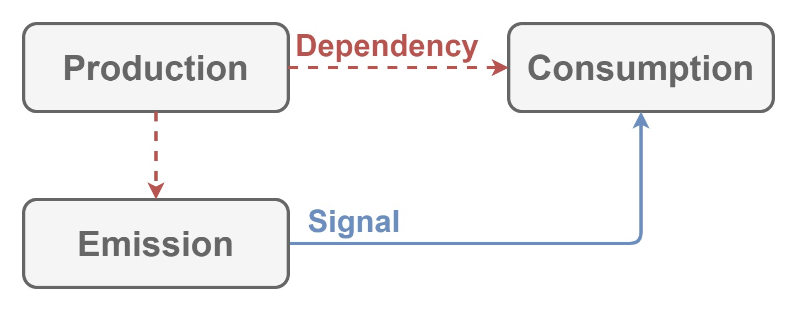

# Signalization

This module defines how to

- generate
- send
- receive

data for user's input/output in XR applications.

## Dependencies

Nothing.

## Architecture

| Word | Abstraction |
|:-----------|:------------|
| Signal | Data for user's input/output. |
| Consumption | Receives `Signal`. |
| Production | Sends `Signal` to `Consumption`. |
| Cancellation | Token to stop producing. |
| Propagation | Collects `Consumption` to distribute `Signal`. |
| Emission | Token to send `Signal`. |
| Transmission | Collects `Consumption` to send `Signal`. |
| Generation | Creates `Signal`. |

A `Consumption` receives a `Signal` for interaction between devices and systems.
A `Production` sends a `Signal` to each of `Consumption`.
When the `Production` starts to send, it provides `Cancellation` token to stop sending.

A `Propagation` is `Consumption` and `Production`.
When the `Propagation` receives a `Signal`, it distributes the `Signal` to each `Consumption`.

A `Emission` is token to send `Signal`, and a `Generation` is how to generate a `Signal`.
A `Transmission` is `Emission` and `Production`.
The `Transmission` has the `Generation`.
So every time the `Transmission` Emits, the `Generation` generates a `Signal`, then it sends the `Signal` to each of `Consumption`.

## Implementation

Nothing because this module only defines how to

- generate
- send
- receive

`Signal`.
