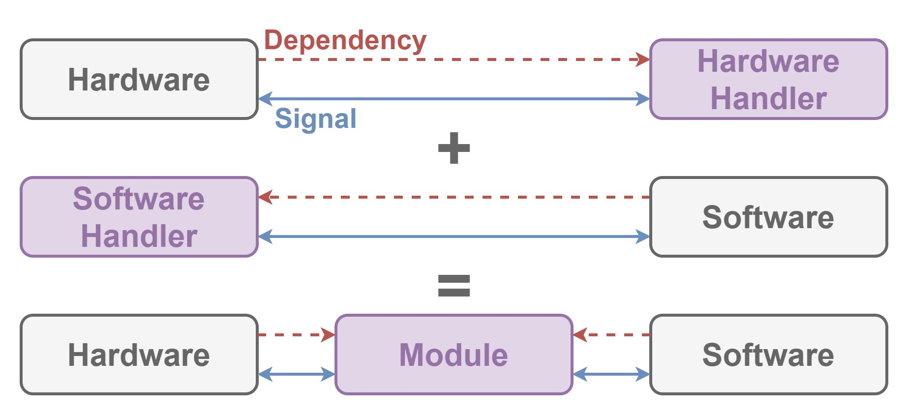

# Unitization

This module extends [Signalization](./Signalization.md) to define how to connect hardware to software.

## Dependencies

This module depends on [Signalization](./Signalization.md).

## Architecture

| Word | Abstraction |
|:-----------|:------------|
| Handler | Provides `Production` and `Consumption`. |
| Connection | Connects `Handler` to send and receive `Signal`. |
| Ignition | `Connection` to emit. |
| Hardware | Sends `Signal` device generated and receives `Signal` system generated. |
| Software | Receives `Signal` device generated and sends `Signal` system generated. |
| Module | Defines `Handler` for `Hardware` and `Software`. |

`Handler` is interface for `Hardware` or `Software`.
`Connection` enables to connect `Handler` in order to send and receive `Signal`.
`Ignition` is `Connection` to emit.

## Implementation

Nothing because this module only defines how to connect hardware to software.
