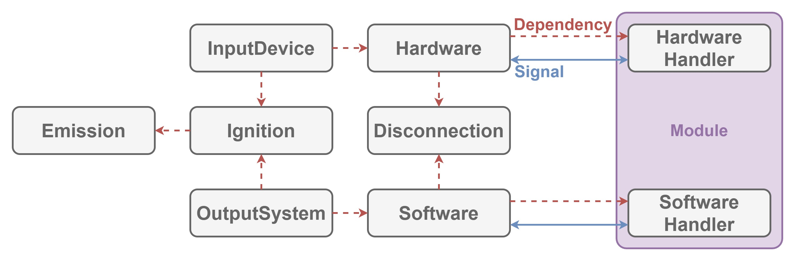

# Unitization

Unitization defines how to connect device to system in order to send and receive `Signal`.

## Dependencies

This module depends on

- [Signalization](./Signalization.md).
- [Conduction](./Conduction.md).

## Architecture

| Word | Abstraction |
|:-----------|:------------|
| Hardware | Now writing... |
| HardwareHandler | Now writing... |
| Software | Now writing... |
| SoftwareHandler | Now writing... |

Now writing...

## Implementation

Nothing because this module only defines how to connect device to system.
