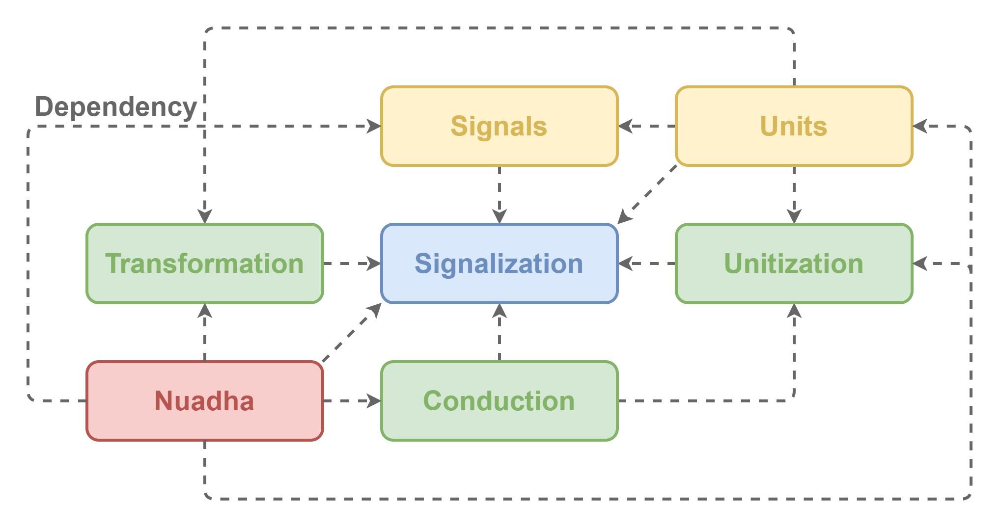

# YggdrAshill.Nuadha: a device management framework

Nuadha is a framework defining how to

- generate
- send
- receive
- convert

I/O data of applications, for mainly XR (VR/AR/MR).  
This framework is able to isolate definitions from implementations for specific platforms like:

- [Unity](https://unity.com/ja)
- [Xamarin](https://docs.microsoft.com/ja-jp/xamarin/get-started/what-is-xamarin)
- [Windows Presentation Foundation (WPF)](https://docs.microsoft.com/ja-jp/visualstudio/designers/getting-started-with-wpf?view=vs-2019)
- [Oculus Store](https://www.oculus.com/)
- [Steam VR](https://store.steampowered.com/steamvr)

## Dependencies

This framework depends on [.NET Standard](https://docs.microsoft.com/ja-jp/dotnet/standard/net-standard) 2.0.

## Installation

Developers should

1. Go to [release pages](https://github.com/do-i-know-it/YggdrAshill.Nuadha/releases).
1. Download DLLs in the latest version.
1. Put the DLLs in C# projects.

to use this framework.

## Usage

Please see [sample applications](https://github.com/do-i-know-it/YggdrAshill.Nuadha/blob/main/YggdrAshill.Nuadha.Samples).

## Architecture

This framework consists of core modules below.

- [Signalization](./Documentation/Signalization.md)
- [Transformation](./Documentation/Transformation.md)
- [Unitization](./Documentation/Unitization.md)
- [Conduction](./Documentation/Conduction.md)

This framework also includes sub modules below.

- [Signals](./Documentation/Signals.md)
- [Units](./Documentation/Units.md)
- [Nuadha](./Documentation/Nuadha.md)

[Nuadha](./Documentation/Nuadha.md) module is an entry point of this framework.

## Known issues

Please see [issues](https://github.com/do-i-know-it/YggdrAshill.Nuadha/issues).

## Future works

Please see [GitHub Project for road map](https://github.com/do-i-know-it/YggdrAshill.Nuadha/projects/1).

- Adds definitions for Signals.
  - ex) Blink
  - ex) Pupil
  - ex) Vibration
- Adds definitions for Units.
  - ex) Tablet
  - ex) Gamepad
  - ex) Eye tracker
  - ex) Face tracker
  - ex) Hand pose tracker
  - ex) Treadmill
- Adds contributing guidelines.

## License

This framework is under the MIT License, see [LICENSE](./LICENSE.md).

## Remarks

This framework is a part of YggdrAshill framework.
We also provides framework below.

- [YggdrAshill.Ragnarok](https://github.com/do-i-know-it/YggdrAshill.Ragnarok)
- [YggdrAshill.Unity](https://github.com/do-i-know-it/YggdrAshill.Unity)
